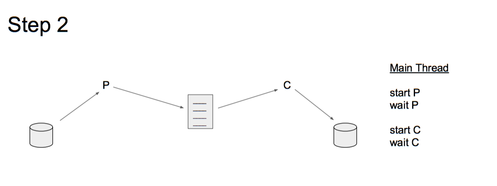
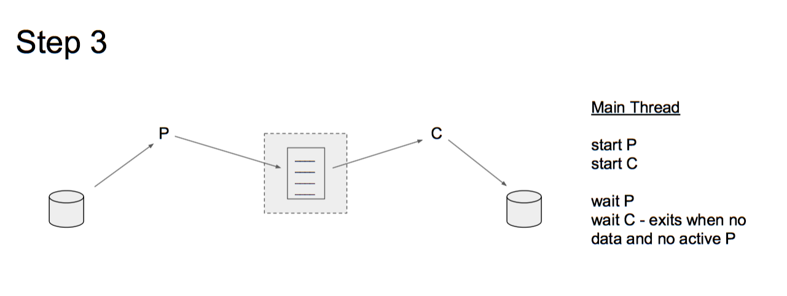
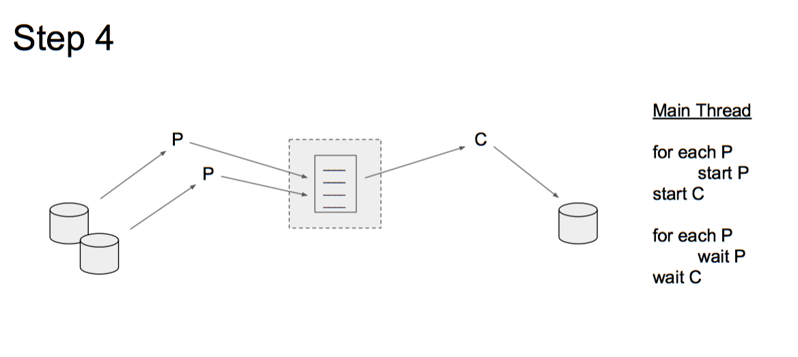
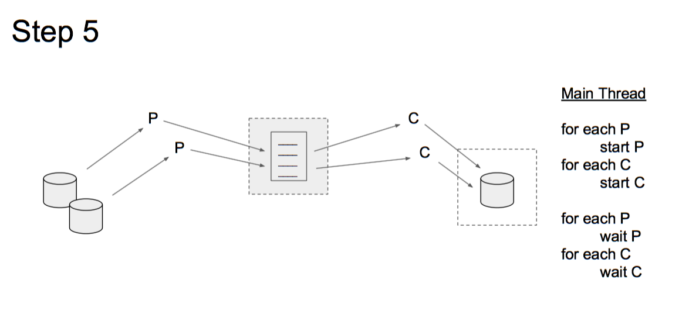
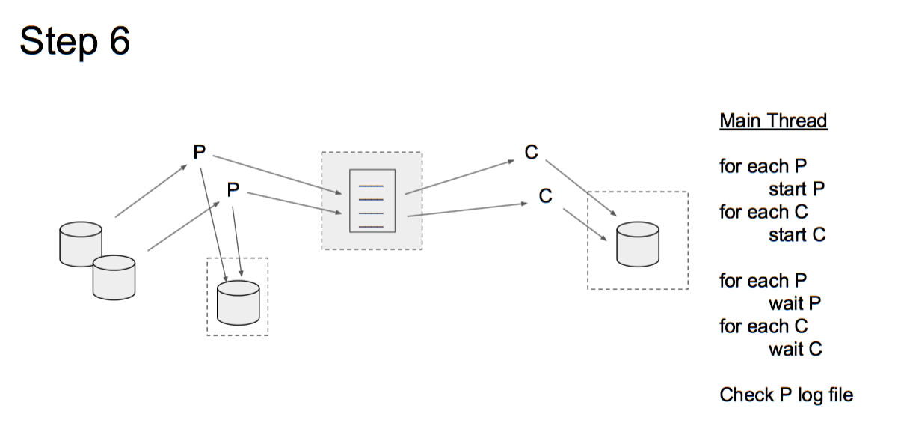

# Programming Assignment 2

**Goal:** Using `pthreads` to code a DNS name resolution engine

## 1. Introduction
In this assignment you will be processing a number of files of data that contains one or more  domain names.  However, networking protocols require IP addresses to be able to deliver messages to the correct server, therefore the domain names must be converted into IP addresses.  Your application will perform this task and create a single file containing the converted data.  

Each line of the input data will need to be parsed to extract the domain names from the other data.   Once a domain name has been extracted, it will need to be resolved. This is similar to the operation performed each time you access a new website in your web browser.  We will supply a function that can take a domain name and return an IP address.  Your task will write the domain name and IP address to a file.

There are many ways that this task could be designed to accomplish these goals.  You could create a monolithic application to encompass all of the goals. The algorithm would contain a number of loops processing each entry and write the new information.
```
for each file
  for each line of file
    parse the line for domain names
    for each domain name
      find IP for domain name
      write information to output file
```
This monolithic solution would work well on a single CPU, but would still be paused waiting for file IO or waiting for the network to resolve the domain name to an IP address.  We can make the solution more efficient by taking advantage of multiple CPUs and using multiple threads to process the data in parallel.

Your solution for this assignment will create a multi-threaded application that resolves domain names to IP addresses. The application is composed of two sub-systems, `parser` and `converter`. The `parser` will extract a domain name from the input data and pass it on to the `converter`, which will find the IP address and write the information to the output file. The sub-systems communicate with each other using a bounded buffer. To make the application even more efficient, you will design it to support multiple `parser` and multiple `converter` so that no single input item can cause the system to be blocked no matter how long it takes its processing to be performed.  See Figure 1 for a visual description.


<table class="image" width=480>
<caption align="bottom">Figure 1: Creation of an application to processes data from multiple files using multiple parsing threads that store data into a shared buffer.  Multiple threads will take items out of the shared buffer for processing.  Shared resources will need to be protected from race conditions using synchronization methods. </caption>
<tr><td>
</td></tr>
</table>

## 2. Description

We have a number of files that list the domain name of a server for which we need an IP address. Your task is to create a program that will process a number of file containing names of servers we want to reach and supply the list of IP addresses matching those domain names. Your program (named: `multi-lookup`) will process each of the given files using a `parser` thread. Each `parser` thread will read each line of the file, parse the domain name, place the name into a shared data area, and record the processing in an output file. You will also create a number of `converter` threads that will take a domain name from the shared data area, find the IP address for that domain name and write the results to another output file.

Once all the lines of all the files have been processed, the `parser` threads will terminate. Once all the names have been processed and there are no `parser` threads running, the `converter` threads will terminate and the program will terminate.

All the status information that needs to be recorded for the `parser` threads will be written to the file name given on the command line. All the status information that needs to be recorded for the `converter` threads will be written to another file name that has also been given on the command line. Just before termination, your program will print (to standard out) the total time that it took to process all the data (time from starting your application until the termination).

### 2.1 Program Arguments

```
NAME
  multi-lookup        resolve a set of domain names to IP addresses

SYNOPSIS
  multi-lookup <# parsing threads> <# conversion threads>
               <parsing log> <converter log> [ <datafile> ...]

DESCRIPTION
     The file names specified by <data file> are passed to the pool of `parser`
     threads which place information into a shared data area. `converter`
     threads read the shared data area and find the corresponding IP address.

  <# parsing threads>    number of requestor threads to place into the
                         thread pool.
  <# conversion threads> number of `converter` threads to place into the
                         thread pool.
  <parsing log>          name of the file into which all the `parser` status
                         information is  written.
  <conversion log>       name of the file into which all the `converter`
                         status information is  written.
  <data file> ...        list of filenames that are to be processed. Each file
                         contains a list of domain names, one per line,
                         that are to be resolved.
```

### 2.2 Input: Name Files

Your application will take as parameters on the command line,  a set of name files to be processed. Each file contains one domain name per line, but may need to be extracted from the other text. Each name file should be serviced by a single `parser` thread. The number of `parser` threads may be less than, or more than, the number of input files.

### 2.3 `Parser` Threads

Your application will take a command line argument to specify the number of `parser` threads. These threads service a set of name files, each of which contains a list of domain names. Each name that is extracted from a line in the file is placed into a shared array. If a `parser` thread tries to write to the array but finds that it is full, it should block until a space opens up in the array. After servicing a name file, a `parser` thread checks if there are any remaining name files to service. If so, it requests one of the remaining name files to process. Once all file have been processed, the thread writes a new line to the parsing log file with its thread id and the number of files it extracted, in the following format:
```
Thread <thread id> serviced ### files.
```
  - Where <thread id> is that threads process id.  To get the thread id of a thread on Linux systems, use `gettid()`.

### 2.4 `Converter` Threads

You will also create a second pool of threads to `converter` process the information provided by the `parser` threads. Each thread in the `converter` thread pool removes a domain name  from the shared array and querys its IP address. After the name has been mapped to an IP address, the result is written to a line in the conversion log file in the following format:

```
www.google.com, 74.125.224.81
```
If a `converter` thread tries to read from the array but finds that it is empty, it should block until there is a new item in the array unless all `parser` threads have terminated.

### 2.5 Synchronization and Deadlock

Your application should synchronize access to shared resources and avoid any deadlock or busy wait. You should use mutexes, semaphores, and/or condition variables to meet this requirement. There are at least three shared resources that must be protected: the shared array, parsing log,  and conversion log. None of these resources is thread-safe by default.

### 2.6 Ending the Program

Your program must end after all names in each file have been serviced by the application. This means that all the domain names in all the input files have received a corresponding line in the output file. At the end, your program must print the total runtime on the standard output. Use `gettimeofday()` system call for this purpose.

## 3. What's Included

Some files are included with this assignment for your benefit. You are not required to use these files, but they may prove helpful.

- `util.c` and `util.h` These two files contain the DNS lookup utility function. This function abstracts away a lot of the complexity involved with performing a DNS lookup. The function accepts a domain name as input and generates a corresponding dot-formatted IPv4 IP address string as output.Please consult the _util.h_ header file for more detailed descriptions of each availablefunction.
- `input/names*.txt` This is a set of sample name files. They follow the same format as mentioned earlier. Use them to test your program.
- `results-ref.txt` This result file is a sample output of the IPs for the domain names from the names1.txt file.
- `performance.py` This is a program to assist you in plotting performance metrics from
running your program with different amounts of `parsor` and `converter` threads. It is
encouraged but not required to understand how this program works.

## 4. Additional Specifications

Many of the specifications for your program are embedded in the descriptions above. This section details additional specifications you must adhere to.


### 4.1 Limits

If necessary, you may impose the following limits on your program. If the user specifies input that would require the violation of an imposed limit, your program should gracefully alert the user to the limit and exit with an error.

- **MAX INPUT FILES**        
10 Files is an optional upper-limit. Your program may also handle more files, or an unbounded number of files, but may not be limited to less than 10 input files.

- **MAX CONVERT THREADS**    
10 Threads is an optional upper-limit. Your program may also handle more threads.

- **MAX NAME LENGTH**        
1025 Characters, including null terminator. This is an optional upper-limit. Your program may handle longer names, but you may not limit the name length to less than 1025 characters.

- **MAX IP LENGTH**         
  INET6_ADDRSTRLEN is an optional upper-limit. Your program may handle longer IP address strings, but you may not limit the name length to less than INET6_ADDRSTRLEN characters including the null terminator.

### 4.2 Error Handling

You must handle the following errors in the following manners:

- **Bogus domain name**   
Given a domain name that can not be resolved, your program should output a blank string for the IP address, such that the output file continues the domain name, followed by a comma, followed by a line return. You should also print a message to stderr alerting the user to the bogus domain name.

- **Bogus Output File Path**  
Given a bad output file path, your program should exit and print an appropriate error to stderr.

- **Bogus Input File Path**   
Given a bad input file path, your program should print an appropriate error to stderr and move on to the next file.

All system and library calls should be checked for errors. If you encounter errors not listed above, you should print an appropriate message to stderr, and then either exit or continue, depending upon whether or not you can recover from the error gracefully.

### 5. Implementation Steps
This is a very difficult application to debug.  If you write all the code for the whole application and then attempt to debug it, you will probably not get the assignment completed by the due date. Remember that it becomes exponentially harder to debug a program with multiple different changes at one time.  To ensure your success, we suggest the following steps be undertaken to incrementally develop the application and limit the possible sources of bugs to speed up debugging.

This application must read parameters from the command line (see section 4.1) with names of files to be processed.  Once you have created a skeleton application that processes information on the command line, you can begin to add in features.  Make sure that you adequately test each of your steps before moving to the next step.  This may require that you write some testing code within your application that can determine if you have performed that step correctly. Once your testing has shown that a step has been completed, you can move on to the next step.  If you add some code and something breaks, then it is either the code you just added, or you did not thoroughly test a previous step.  Usually it is the new code that has been added.

#### Step 1
The first step is to create a simple program to create a parsing thread that will repeatedly read a line from a given file and add an entry into the shared buffer.  You will need to validate that the buffer has the correct number of entries.


#### Step 2
The next step is to use the parsing thread to create a number of entries in the buffer.  Once that process is complete, start a conversion thread to take items out of the buffer.  You can write the results to the output files.


#### Step 3
Once you are assured that your application can write and read to the buffer correctly (although serially), then try to make them run concurrently.  Multiple processes accessing and modifying the same data can cause race conditions.  You must protect the critical sections of each thread  with a mutex.



#### Step 4
We can now run with a single `parsor` and a single `converter` passing information via a shared buffer that is protected by a mutex.  Lets take the next step and create multiple `parsor` threads to read from multiple different files.  Each `parsor` can read single lines from a different file.  The `parsor` will terminate when all lines from the file have been  processed.



#### Step 5
The next step will create multiple `converter` threads to read from multiple `parsor` threads via a single shared buffer.  The `converter` will wait for data (spin wait is acceptable) but will terminate if there are no active `parsor` and the buffer is empty.  


#### Step 6
Moving back to the `parsor` threads, each thread must record the data it has processed.  Files are a shared resource and therefore must be protected from multiple processes accessing it.


#### Step 7 - extra credit
The last step of your implementation is to create a method of handling different numbers of files and parsing threads.  This can be accomplished by creating an API for the parsing threads to access a single line from a file.  This API will abstract the number of files being handled and the mechanism used to manage the files.  The parsing threads only need to request a line from a file and let the API  provide it.  The implementation of the file handling might use a FCFS policy to handle all the lines of one file before going to the next file, or it might use a Round Robin policy that will read the next line from each file before returning to read another line from the first file.


### 6. External Resources

You may use the following libraries and code to complete this assignment, as well as anything you have written for this assignment:

- Any functions listed in util.h
- Any functions in the C Standard Library
- Standard Linux pthread functions
- Standard Linux Random Number Generator functions
- Standard Linux file i/o functions

If you would like to use additional external libraries, you must clear it with the TA first. You will **not** be allowed to use pre-existing thread-safe queue or file i/o libraries since the point of this assignment is to teach you how to make non-thread-safe resources thread-safe.

## 7. What You Must Provide

To receive full credit, you must submit the following items to Moodle by the due date. Please combine the files into a single zip or tar archive.

- `multi-lookup.c` Your program, conforming to the above requirements.
- `multi-lookup.h` A header file containing prototypes for any function you write as part of your program.
- `Makefile` A makefile that builds your program as the default target. It should also contain a “clean” target that will remove any files generated during the course of building and/or running your program.
- `README` A readme describing how to build and run your program.


# 8. Grading

To received full credit your program must:

- Meet all requirements elicited in this document.
- Build with `-Wall` and `-Wextra` enabled, producing no errors or warnings.
- Run without leaking any memory, as measured using valgrind

To verify that you do not leak memory, TAs may use `valgrind` to test your program. To
install valgrind, use the following command:

```
sudo apt-get install valgrind
```

And to use `valgrind` to monitor your program, use this command:

```
valgrind ./pa2main text1.txt text2.txt ...... textN.txt results.txt
```

Valgrind should report that you have freed all allocated memory and should not produce any additional warnings or errors.

You can write your code in any environment you like. But you have to make sure that your programs can be compiled and executed in the Virtual Machine that has been provided for this class or on the CSEL machines.

## Extra Credit

There are a few options for receiving extra credit on this assignment. Completion of each of the following items will gain you 5 points of extra credit per item.

- **Parsing out multiple Domain Names per input file line**
Each line can contain more than one domain name.  `Parser` threads would need to handle extraction of multiple names per line.

- **Creating API for Accessing Input Data**
Step 7 in the description above creates an API to abstract access to the input lines for the `parsor` threads.

- **Multiple IP Addresses**   
Many domain names return more than a single IP address. Add support for listing an arbitrary number of addresses to your program.  You may find it necessary to modify code in the util.h and util.c files to add this functionality. If you do this, please maintain backwards compatibility with the existing `util.h` functions. This is most easily done by adding new function instead of modifying the existing ones.   These addresses should be printed to the output file as additional comma-separated strings after the domain name.

```
                www.google.com, 74.125.224.81, 76.125.232.80, 75.125.211.70
```

- **IPv6 Support and Testing**  
Add support for IPv6 IP addresses and find an IPv6 aware environment where you can test this support. Since IPv6 is relatively new, finding an environment for testing this support is probably harder than adding it. You must be able to demonstrate IPv6 support during your grading session to receive credit for this item. You may find it necessary to modify code in util.h and util.c to complete this item. If you do so, please maintain backward compatibility with the existing code.

# 9. References

Refer to your textbook and class notes on the Moodle for descriptions of producer/consumer and reader/writer problems and the different strategies used to solve them.

The Internet is also a good resource for finding information related to solving this assignment.
