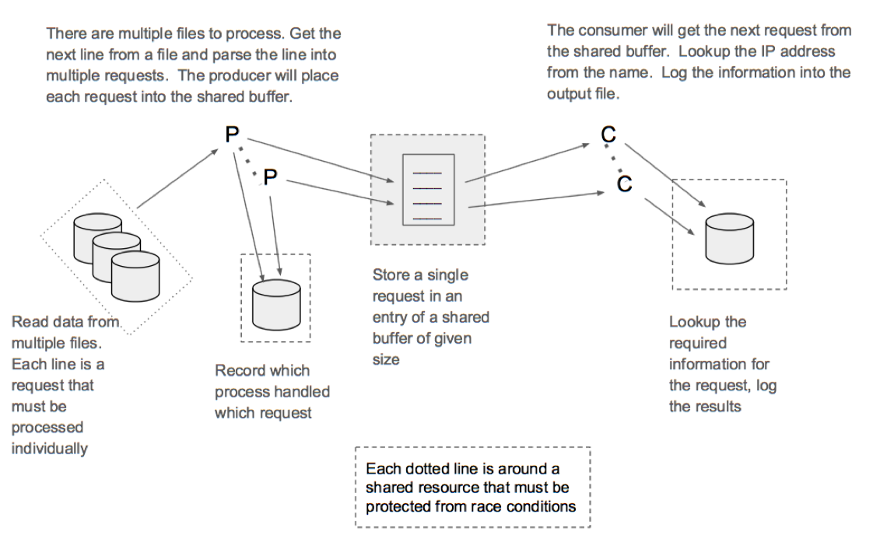
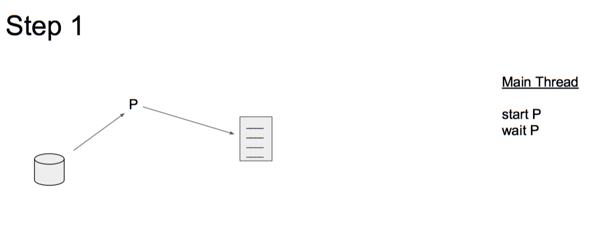
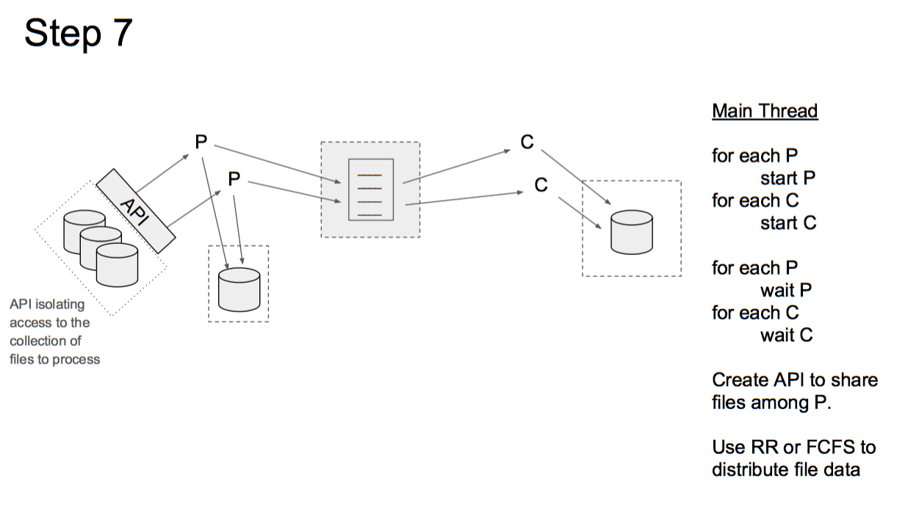

# Programming Assignment Three

**Goal:** Using Pthreads to code a DNS name resolution engine

## 1 Introduction

In this assignment you will develop a multi-threaded application that resolves domain names to IP addresses, similar to the operation performed each time you access a new website in your web browser. The application is composed of two sub-systems, each with one thread pool: requesters and resolvers. The sub-systems communicate with each other using a bounded array. See Figure 1 for a visual description.



We have a number of files that list the domain name of a server for which we need an IP address. Your task is to create a program that will process a number of file containing names of servers we want to reach and supply the list of IP addresses matching those host names. Your program (`multi-lookup`) will process a number of files containing a list of hostnames using a requester thread to process each file. Each requester thread will read each line of the file, parse the hostname, place the name into a shared data area, and record the processing in a file. You will also create a number of resolver threads that will take the names from the shared data area, find the IP address for that host name and write the results to a file.

Once all the files have been processed the requester threads will terminate. Once all the names have been processed the resolver threads will terminate and the program will terminate.

All the status information that needs to be recorded for the requestor threads will be written to a file named serviced.txt in the current working directory. All the status information that needs to be recorded for the resolver threads will be written to a file named results.txt in the current working directory. Just before termination, your program will print (to standard out) the total time that it took to process all the data.

## 2 Description

### 2.1 Input: Name Files

Your application will take as input a set of name files. Name files contain one hostname per line. Each name file should be serviced by a single requester thread from the requester thread pool. The number of requester threads may be less than or more than the number of input file.

### 2.2 Requester Threads

Your application will take as input the number of requester threads. These threads service a set of name files, each of which contains a list of domain names. Each name that is read from each of the files is placed on a shared array. If a requester thread tries to write to the array but finds that it is full, it should block until a space opens up in the array. After servicing a name file, a requester thread checks if there are any remaining name files to service. If so, it requests one of the remaining name files next. This process goes on until all name files have been serviced. If there are no more name files remaining, the thread writes the number of files it serviced in a new line in a file named serviced.txt in the following format:

Thread _thread id_ serviced ### files.

  - To get the thread id of a thread on Linux systems, use `gettid()`.

### 2.3 Resolver Threads

The second thread pool is comprised of a set of resolver threads. The resolver thread pool services the shared array by taking a name off the array and querying its IP address. After the name has been mapped to an IP address, the output is written to a line in the results.txt file in the following format:

```
www.google.com,74.125.224.81
```
If a resolver thread tries to read from the array but finds that it is empty, it should block until there is a new item in the array or all names in the input files have been serviced.

### 2.4 Synchronization and Deadlock

Your application should synchronize access to shared resources and avoid any deadlock or busy wait. You should use mutexes and condition variables to meet this requirement. There are at least three shared resources that must be protected: the shared array, serviced.txt and `result.txt`. None of these resources is thread-safe by default.

### 2.5 Ending the Program

Your program must end after all names in each file have been serviced by the application. This means that all the hostnames in all the input files have received a corresponding line in the output file. At the end, your program must print the total runtime on the standard output. Use `gettimeofday()` system call for this purpose.

## 3 What's Included

Some files are included with this assignment for your benefit. You are not required to use these files, but they may prove helpful.

- `util.c` and `util.h` These two files contain the DNS lookup utility function. This function abstracts away a lot of the complexity involved with performing a DNS lookup. The function accepts a hostname as input and generates a corresponding dot-formatted IPv4 IP address string as output.Please consult the _util.h_ header file for more detailed descriptions of each availablefunction.
- `input/names*.txt` This is a set of sample name files. They follow the same format as mentioned earlier. Use them to test your program.
- `results-ref.txt` This result file is a sample output of the IPs for the hostnames from the names1.txt file.
- `performance.py` This is a program to assist you in plotting performance metrics from
running your program with different amounts of requestors and resolver threads. It is
encouraged but not required to understand how this program works.

## 4 Additional Specifications

Many of the specifications for your program are embedded in the descriptions above. This section details additional specifications you must adhere to.

### 4.1 Program Argument

```
NAME
  multi-lookup        resolve a set of hostnames to IP addresses

SYNOPSIS
  multi-lookup <# requester> <# resolver> <requester log> <resolver log> [ <datafile> ...]

DESCRIPTION
  The file names specified by <data file> are passed to the pool of requester threads
  which place information into a shared data area. Resolver threads read the shared
  data area and find the corresponding IP address.
  <# requesters> number of requestor threads to place into the thread pool.
  <# resolvers> number of resolver threads to place into the thread pool.
  <requester log> name of the file into which all the requester status information is
  written.
  <resolver log> name of the file into which all the resolver status information is
  written.
  <data file> list of filenames that are to be processed. Each file contains a list of host
  names, one per line, that are to be resolved.
```

### 4.2 Limits

If necessary, you may impose the following limits on your program. If the user specifies input that would require the violation of an imposed limit, your program should gracefully alert the user to the limit and exit with an error.

- **MAX INPUT FILES:** 10 Files (This is an optional upper-limit. Your program may also handle more files, or an unbounded number of files, but may not be limited to less than 10 input files.)
- **MAX RESOLVER THREADS:** 10 Threads. This is an optional upper-limit. Your program may also handle more threads.
- **MAX NAME LENGTH:** 1025 Characters, including null terminator (This is an optional upper-limit. Your program may handle longer names, but you may not limit the name length to less than 1025 characters.)
- **MAX IP LENGTH:** INET6 ADDRSTRLEN (This is an optional upper-limit. Your program may handle longer IP address strings, but you may not limit the name length to less than INET6 ADDRSTRLEN characters including the null terminator.)

### 4.3 Error Handling

You must handle the following errors in the following manners:

- **Bogus Hostname:** Given a hostname that can not be resolved, your program should output a blank string for the IP address, such that the output file continues the hostname, followed by a comma, followed by a line return. You should also print a message to stderr alerting the user to the bogus hostname.
- **Bogus Output File Path:** Given a bad output file path, your program should exit and print an appropriate error to stderr.
- **Bogus Input File Path:** Given a bad input file path, your program should print an appropriate error to stderr and move on to the next file.

All system and library calls should be checked for errors. If you encounter errors not listed above, you should print an appropriate message to stderr, and then either exit or continue, depending upon whether or not you can recover from the error gracefully.

### 5 Implementation Steps
This is a very difficult application to debug.  If you write all the code for the whole application and then attempt to debug it, you will probably not get the assignment completed by the due date.  To ensure your success, we suggest the following steps be undertaken to incrementally develop the application and limit the possible sources of bugs to speed up debugging.

This application must read parameters from the command line (see section 4.1) with names of files to be processed.  Once you have created a skeleton application that processes information on the command line, you can begin to add in features.  Make sure that you adequately test each of your steps before moving to the next step.  This may require that you write some testing code within your application that can determine if you have performed that step correctly. Once your testing has shown that a step has been completed, you can move on to the next step.  If you add some code and something breaks, then it is either the code you just added, or you did not thoroughly test a previous step.  Usually it is the new code that has been added.

#### Step 1
The first step is to create a simple program to repeatedly read a line from a given file and add an entry into the shared buffer.  You will need to validate that the buffer has the correct number of entries.


#### Step 2
The next step is to use the producer to create a number of entries in the buffer.  Once that process is complete, start a consumer to take items out of the buffer.  You can write the results to the output or to a file.


#### Step 3
Once you are assured that your application can write and read to the buffer correctly (although serially), then try to make them run concurrently.  Multiple processes accessing and modifying the same data can cause race conditions.  You must protect the critical sections with a mutex.


#### Step 4
We can now run with a single producer and a single consumer passing information via a shared buffer that is protected by a mutex.  Lets take the next step and create multiple producers to read from multiple different files.  Each producer can read single lines from a different file.  The producer will terminate when all lines from the file have been  processed.


#### Step 5
The next step will create multiple consumers to read from multiple producers via a single shared buffer.  The consumers will wait for data (spin wait is acceptable) but will terminate if there are no active producers and the buffer is empty.  


#### Step 6
Moving back to the producers, each thread must record the data it has processed.  Files are a shared resource and therefore must be protected from multiple processes accessing it.


#### Step 7
The last step of your implementation is to create a method of handling different numbers of files and producers.  This can be accomplished by creating an API for the producers to access.  This API will abstract the number of files being handled and the mechanism used to manage the files.  The producers only need to request a line from a file and the API can provide it.  The implementation of the file handling might use a FCFS policy to handle all the lines of one file before going to the next file, or it might use a Round Robin policy that will read the next line from each file before returning to read another line from the first file.



### 6 External Resources

You may use the following libraries and code to complete this assignment, as well as anything you have written for this assignment:

- Any functions listed in util.h
- Any functions in the C Standard Library
- Standard Linux pthread functions
- Standard Linux Random Number Generator functions
- Standard Linux file i/o functions

If you would like to use additional external libraries, you must clear it with the TA first. You will **not** be allowed to use pre-existing thread-safe queue or file i/o libraries since the point of this assignment is to teach you how to make non-thread-safe resources thread-safe.

## 7 What You Must Provide

To receive full credit, you must submit the following items to Moodle by the due date. Please combine the files into a single zip or tar archive.

- `multi-lookup.c` Your program, conforming to the above requirements.
- `multi-lookup.h` A header file containing prototypes for any function you write as part of your program.
- `Makefile` A makefile that builds your program as the default target. It should also contain a “clean” target that will remove any files generated during the course of building and/or running your program.
- `README` A readme describing how to build and run your program.
- `performance.txt` Run your program over the five input files provided in the input directory for six different scenarios: 1 requester thread and 1 resolver thread, 1 requester thread and 3 resolver threads, 3 requester threads and 1 resolver thread, 3 requester threads and 3 resolver threads, 5 requester threads and 5 resolver threads, and 8 requester threads and 5 resolver threads.

For each scenario, provide the following information in a file named performance.txt.
Use the following format:

- Number for requester thread = xxx
- Number for resolver thread = xxx
- Total run time: xxx
- For each thread, thread id and the number of input files serviced

NOTE: This should be trivial to implement in a script or in another C program, though it is not required to do so.

Afterwards, make sure your program works with the provided performance.py script to generate a 3D graph of these relationships. Use the following command to run the script. Sending output to `/dev/null` will keep your terminal clear and the & will run the program in the background.

```
./performance.py multi-lookup > /dev/null &
```

Finally, at the end of your performance.txt file, provide a 1-2 paragraph explanation of the differences in runtimes among the six scenarios, comparing your results to those generated by the graph.

Any additional files necessary to build or run your program


# 8 Grading

To received full credit your program must:

- Meet all requirements elicited in this document.
- Build with “-Wall” and “-Wextra” enabled, producing no errors or warnings.
- Run without leaking any memory, as measured using valgrind

To verify that you do not leak memory, TAs may use `valgrind` to test your program. To
install valgrind, use the following command:

```
sudo apt-get install valgrind
```

And to use `valgrind` to monitor your program, use this command:

```
valgrind ./pa2main text1.txt text2.txt ...... textN.txt results.txt
```

Valgrind should report that you have freed all allocated memory and should not produce any additional warnings or errors.

You can write your code in any environment you like. But you have to make sure that your programs can be compiled and executed in the Virtual Machine that has been provided for this class or on the CSEL machines.

## Extra Credit

There are a few options for receiving extra credit on this assignment. Completion of each of the following items will gain you 5 points of extra credit per item.

- **Multiple IP Addresses:**  Many hostnames return more than a single IP address. Add support for listing an arbitrary number of addresses to your program. These addresses should be printed to the output file as additional comma-separated strings after the hostname. For example:

```
www.google.com,74.125.224.81,76.125.232.80,75.125.211.70
```

You may find it necessary to modify code in the util.h and util.c files to add this functionality. If you do this, please maintain backwards compatibility with the existing `util.h` functions. This is most easily done by adding new function instead of modifying the existing ones.

**IPv6 Support and Testing:** Add support for IPv6 IP addresses and find an IPv6 aware environment where you can test this support. Since IPv6 is relatively new, finding an environment for testing this support is probably harder than adding it. You must be able to demonstrate IPv6 support during your grading session to receive credit for this item. You may find it necessary to modify code in util.h and util.c to complete this item. If you do so, please maintain backward compatibility with the existing code.

# 9 References

Refer to your textbook and class notes on the Moodle for descriptions of producer/consumer and reader/writer problems and the different strategies used to solve them.

The Internet is also a good resource for finding information related to solving this assignment.
